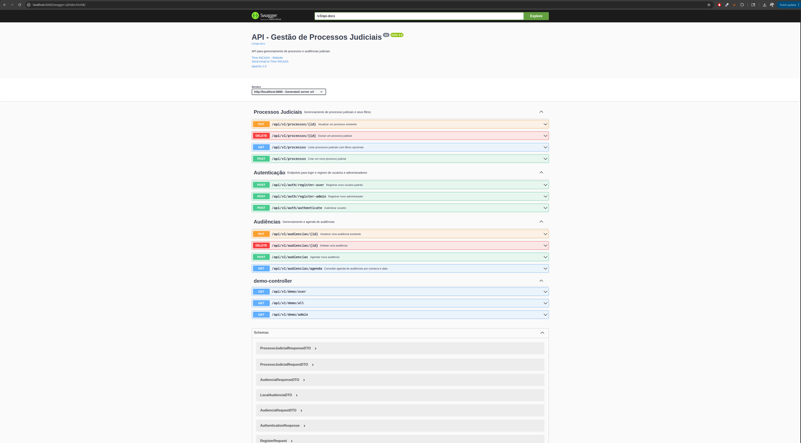

# 📙 Sistema de Gestão de Processos e Audiências - TJRN

Este sistema permite o gerenciamento de **processos judiciais** e **audiências**, com controle de agenda, validações de negócio, conflitos de horário e autenticação baseada em roles.

---

## ✨ Como Rodar o Projeto

### 1. Clonar o Repositório

```bash
git clone https://github.com/raulmss/processos-judiciais-incaas.git
cd processos-judiciais-incaas
```

### 2. Configurar o Banco de Dados

A configuração atual utiliza o H2, mas você pode facilmente alterar para MySQL ou outro banco de dados relacional.

No arquivo `src/main/resources/application.yml`, configure:

```yaml
spring:
  datasource:
    url: jdbc:h2:mem:testdb #altere para jdbc:mysql://localhost:3306/seu_banco se usar MySQL
    driver-class-name: org.h2.Driver # ou org.mysql.Driver se usar MySQL
    username: sa # ou seu usuário MySQL
    password: # deixe vazio para H2, ou coloque sua senha MySQL
```

### 3. Rodar o Projeto

```bash
./mvnw spring-boot:run
```

A aplicação ficará disponível em:

```
http://localhost:8080
```

### 4. Acessar a API
Para utilizar as APIs, é possivel utilizar a collection do Postman que pode ser baixada em [IncaaS.postman_collection.json](otherAssets/IncaaS.postman_collection.json).

### 🔐 Autenticação com Bearer Token
Esta collection Postman utiliza uma **variável de coleção** chamada `{{token}}` para facilitar o uso de autenticação. Após registrar ou autenticar um usuário, o token JWT retornado é armazenado automaticamente com o seguinte script:

### 🔑 Endpoints de Autenticação (`/api/v1/auth`)

#### `POST /register-user`
Registra um novo **usuário comum** (`ROLE_USER`).

**Corpo:**
```json
{
  "firstName": "Raul",
  "lastName": "Santos",
  "email": "lorenzo@mail.com",
  "password": "1234"
}
```

---

#### `POST /register-admin`
Registra um novo **administrador** (`ROLE_ADMIN`).

**Corpo:**
```json
{
  "firstName": "Admin",
  "lastName": "Root",
  "email": "admin@email.com",
  "password": "admin123"
}
```

---

#### `POST /authenticate`
Autentica um usuário (comum ou admin) e retorna o token JWT.

**Corpo:**
```json
{
  "email": "lorenzo@mail.com",
  "password": "1234"
}
```

---

### ⚖️ Endpoints de Processo Judicial (`/api/v1/processos`)

#### `POST /`
Cria um novo processo judicial.

**Corpo:**
```json
{
  "numeroProcesso": "1234567-89.2023.1.12.0004",
  "vara": "Vara Cível 1",
  "comarca": "Parnamirim",
  "assunto": "Cobrança de dívida",
  "status": "ATIVO"
}
```

---

#### `PUT /{id}`
Atualiza um processo existente com o ID informado.

**Corpo:**
```json
{
  "numeroProcesso": "1234567-89.2023.1.12.0004",
  "vara": "Vara Cível 12",
  "comarca": "Natal",
  "assunto": "Cobrança de dívida",
  "status": "ATIVO"
}
```

---

#### `GET /`
Lista processos com suporte a filtros:

**Query Params:**
- `status`: `"ATIVO"` ou `"INATIVO"`
- `comarca`: nome da comarca
- `page`: número da página (opcional)
- `size`: tamanho da página (opcional)

**Exemplo:**
```
/api/v1/processos?status=ATIVO&comarca=Parnamirim&page=0&size=10
```

---

#### `DELETE /{id}`
Remove um processo (necessário ser ADMIN).

---

### 🧑‍⚖️ Endpoints de Audiências (`/api/v1/audiencias`)

#### `POST /`
Agendar uma nova audiência.

**Corpo:**
```json
{
  "dataHoraInicio": "2025-07-01T10:00:00Z",
  "dataHoraFim": "2025-07-01T11:00:00Z",
  "tipo": "INSTRUCAO",
  "local": {
    "nome": "Sala 1",
    "rua": "Rua Central",
    "numero": "100",
    "bairro": "Centro",
    "cep": "59000-000",
    "estado": "RN",
    "pais": "Brasil"
  },
  "processoId": 1
}
```

---

#### `PUT /{id}`
Atualiza uma audiência existente.
Utiliza mesmo corpo do `POST /` com o ID da audiência no path.

---

#### `GET /agenda`
Consulta audiências por **comarca** e **data**.

**Query Params:**
- `comarca`: nome da comarca (ex: `Parnamirim`)
- `data`: data no formato `yyyy-MM-dd` (ex: `2025-07-01`)

**Exemplo:**
```
/api/v1/audiencias/agenda?comarca=Parnamirim&data=2025-07-01
```

---

### `DELETE /{id}`
Deleta uma audiência pelo ID (necessário ser ADMIN).

---

Para ver a documentação da API, acesse:
Swagger UI: [http://localhost:8080/swagger-ui/index.html](http://localhost:8080/swagger-ui/index.html)
<p align="center">
  
</p>


---

## ✅ Testes

Execute com:

```bash
./mvnw test
```

### Testes Unitários (isolam lógica de negócio com Mockito)

* **AudienciaServiceImplTest**: testa regras de agendamento, conflito, datas inválidas e atualização de audiências.
* **ProcessoJudicialServiceImplTest**: testa criação, atualização e restrições (como não alterar número do processo).

### Testes de Integração (MockMvc com banco real)

* **ProcessoJudicialControllerIntegrationTest**: criação, filtro, validação de formato e exclusão de processo via API.
* **AudienciaControllerIntegrationTest**: agendamento, conflito, consulta de agenda, atualização e remoção de audiência pela API.

---

## 🚀 Dependências Utilizadas

| Dependência                        | Finalidade                                                 |
| ---------------------------------- | ---------------------------------------------------------- |
| **Spring Boot Starter Web**        | Criação da API REST                                        |
| **Spring Boot Starter Data JPA**   | Integração com banco de dados via Hibernate                |
| **Spring Boot Starter Security**   | Controle de acesso com roles (ADMIN, USER)                 |
| **Spring Boot Starter Validation** | Validação de campos com anotações como @NotBlank, @Pattern |
| **H2 Database**                    | Banco em memória para testes                               |
| **Springdoc OpenAPI (Swagger)**    | Documentação interativa da API                             |
| **JUnit 5**                        | Estrutura de testes                                        |
| **Mockito**                        | Mock de dependências para testes unitários                 |
| **Spring Boot Starter Test**       | Conjunto de ferramentas de teste                           |

---

## 🙌 Dúvidas?

Acesse [http://localhost:8080/swagger-ui/index.html](http://localhost:8080/swagger-ui/index.html) para explorar os endpoints!

---

Desenvolvido por **Raul Souto**
[www.raulsouto.com](http://www.raulsouto.com)
